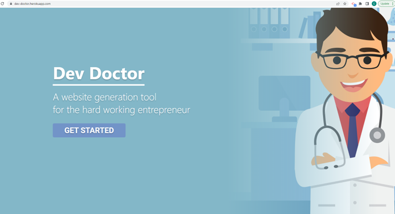
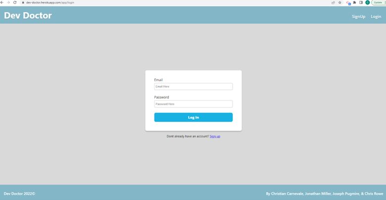

# Dev Doctor 

## Table of Contents
[User Story](#UserStory)
[Description](#description)
[Installation](#installation)
[License](#license)
[Usage](#usage)
[Contribution](#contribution)
[Questions](#questions) 

## User Story
As a Business Owner or NonProfit,
I want an easy way to create simple webpages

So that I can advertise and provide information about my organization

## Description 
Our group project consisting of Christian Carnevale, Jonathan Miller, Joseph Pugmire, and Chris Rowe developed a place where nontechnical users could go and easily create and preview their unique webpage. This normally difficult and challenging project is now painless for the everyday user!  Furthermore, the user can create and preview many different webpages/projects and store all of them!  Then the user only needs to choose which projects they want to deploy and/or enhance and obtain the appropriate technical expert to do that.   
## Badges

## Installation
This is a full stack website deployed on heroku.
## License
MIT
## Usage
While this application can save an organization money as well as to expedite the time to develop a website, it also may be used to make a personal website just for fun.  
## Contribution
Christian Carnevale, Jonathan Miller, Joseph Pugmire and Chris Rowe
## Questions 
###   GitHub Username:  jdmill (Jonathan Miller) 
###   GitHub Repository:  devdoc
###   Email:  cncarnevale@gmail.com (Christian Carnevale)
###   Email: jonathan.d.mllr@gmail.com (Jonathan Miller)
###   Email: jospugg@gmail.com (Joseph Pugmire)
###   Email: Rowe2ry@gmail.com (Chris Rowe)

## Deployment
https://dev-doctor.herokuapp.com/

## Screenshots

